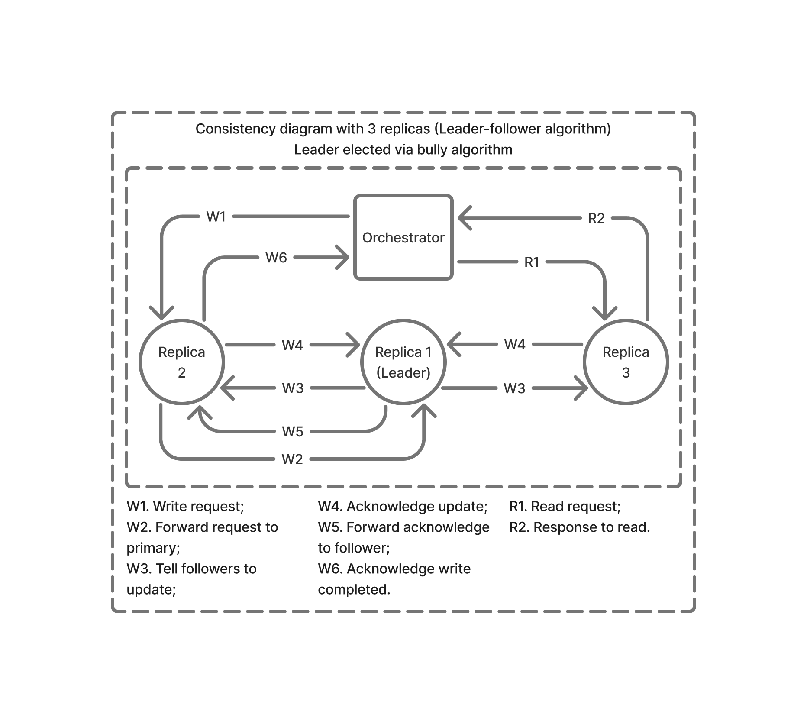
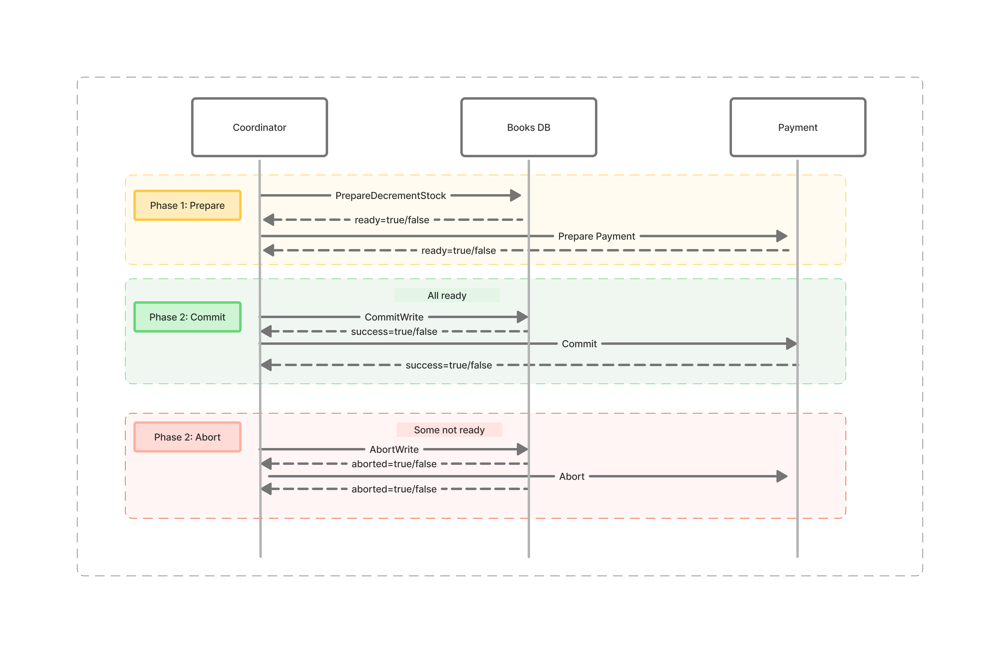
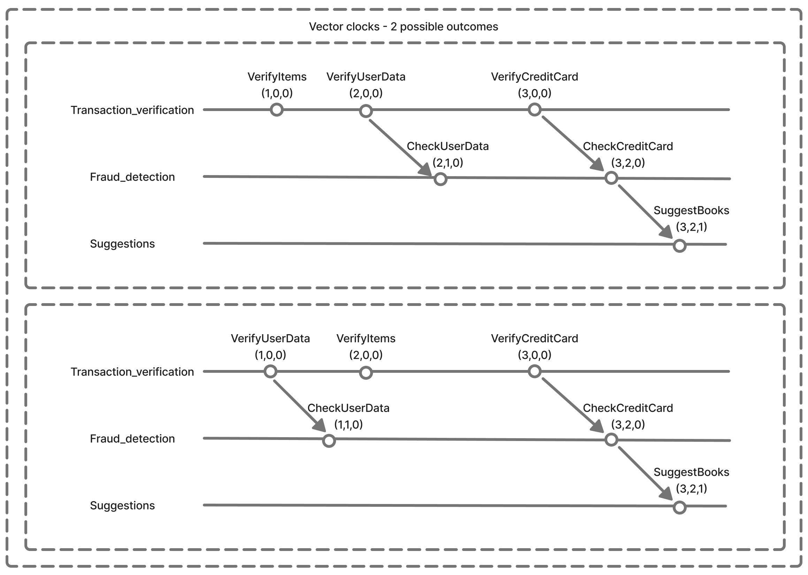
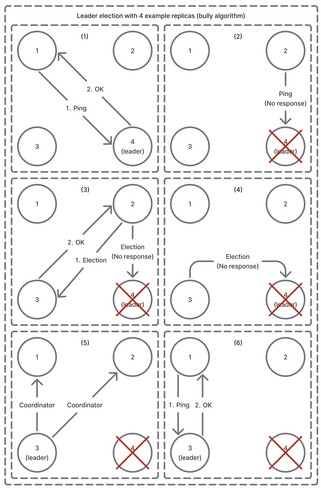
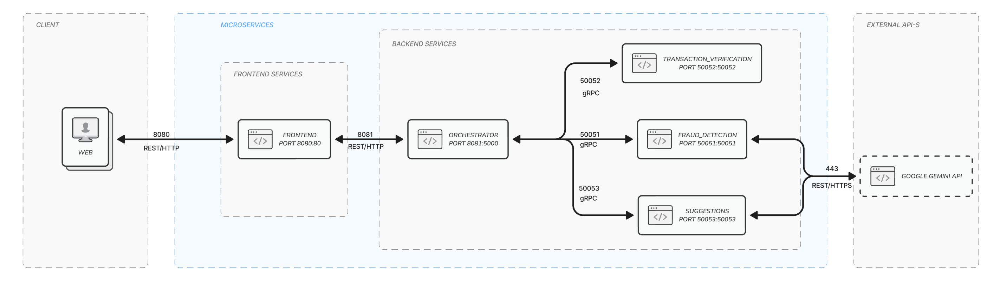
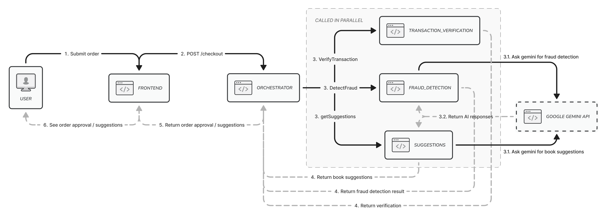

# Documentation

## Project Overview
This project is a distributed system for an online book store in the distributed systems course.

## Project Structure
```
/
├── docs/                       # Project documentation
├── fraud_detection/            # Fraud detection service
├── frontend/                   # Frontend client
├── orchestrator/               # Orchestration service for managing other services
├── order_executor/             # Order execution service
├── order_queue/                # Order queue management service
├── suggestions/                # Book suggestions service
├── transaction_verification/   # Transaction verification service
├── utils/                      # Shared utilities and libraries (gRPC, OpenAPI)
├── docker-compose.yaml         # Docker Compose configuration
```

## System Architecture

The system implements a client-server architecture with the Orchestrator service acting as the central coordination point. Clients interact with the Orchestrator service through synchronous REST/HTTP calls to place book orders.

Upon receiving client requests, the Orchestrator service coordinates with specialized microservices (Fraud Detection, Transaction Verification, Suggestions, Order Queue, and Order Executor) via gRPC to fulfill the order processing workflow. It manages concurrent interactions with downstream services using a multi-threaded approach. Despite this parallelization, all service-to-service communications maintain synchronous request-response patterns, ensuring transaction integrity.

Vector clocks are used in Fraud Detection, Transaction Verification, and Suggestions services to maintain causal ordering of events, ensuring consistency and traceability of operations.

The Order Executor service processes the queued orders by the Order Queue service for final execution. To ensure high availability and fault tolerance, the Order Executor runs with multiple replicas using a leader election mechanism based on the Bully Algorithm. This approach allows the system to automatically detect and recover from failures while also avoiding duplicate order processing, as only the leader replica executes orders.

## Consistency Protocol Diagram



## Distributed Commitment Protocol Diagram

## Vector Clocks Diagram



## Leader Election Diagram



## Architecture Diagram



The architecture diagram illustrates the distributed system with the following components:
- **Frontend**: Client application for user interaction (port 8080);
- **Orchestrator**: Central service for managing other services (port 8081);
- **Fraud Detection**: Service for detecting fraudulent transactions (port 50051);
- **Transaction Verification**: Service for verifying user transactions (port 50052);
- **Suggestions**: Service for providing book recommendations (port 50053);
- **Order Executor**: Service for executing validated orders (port 50054);
- **Order Queue**: Service for managing order processing queue (port 50055 locally);

Communication between the frontend and orchestrator happens over REST/HTTP, while service-to-service communication occurs over gRPC. Fraud Detection and Suggestions services utilize external Google Gemini API for AI-based fraud detection and book recommendations via REST/HTTP.

## System Diagram



This diagram shows the request lifecycle:
1. The client submits an order request through the frontend;
2. The frontend sends the request to the Orchestrator service;
3. The Orchestrator service calls the Fraud Detection, Transaction Verification, and Suggestions services concurrently to process the order;
    1. The Fraud Detection and Suggestions services call the Google Gemini API for fraud detection and book recommendations;
    2. Google Gemini API responds with the fraud detection result and book recommendations;
4. The Services respond to the Orchestrator service with their results;
5. If order is approved, it may be passed to the Order Queue and Order Executor services;
6. The Orchestrator service aggregates the responses and sends the final order status to the frontend;
7. The frontend displays the order status to the client.

## Setup
1. Clone the repository;
2. Create `.env` files in `fraud_detection` and `suggestions` directories with the following content:
    ```
    GOOGLE_API_KEY=<your_google_api_key>
    ```
3. Run `docker compose up` to start all services;
4. Access the frontend at `http://localhost:8080`.
